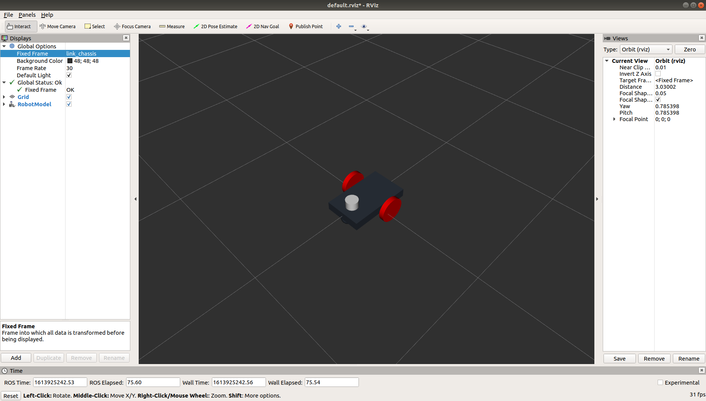

# Lesson 0 - Build Robot Model with URDF

Objectives
- Build a two-wheeled, differential drive robot model
- Visualize model with rviz

This lesson illustrates how to visualize the robot model with rviz.</br></br>

## Create Directory Structure

Start by creating a directory structure for our workspace and a ROS package named ddbot_description. Open a terminal and type the following commands.

```bash
mkdir -p ddbot_ws/src
cd ddbot_ws/src/
catkin_create_pkg ddbot_description
```

This will set up the catkin workspace and create a package.xml and CMakeLists.txt for our package named ddbot_description. Next, we will create two new folders in our package.

```bash
cd ddbot_description/
mkdir launch urdf rviz
```

## Robot Model

The robot model consists of link elements, joint elements, and gazebo plugins. A link element is a rigid component. Links are attached to other links via joints. The joint elements specify the relative motion between links. Typically, joints allow for rotation or translation.

The common properties specified for links and joints are inertial, collision, and visual. Inertial and collision properties enable physics simulation. The visual properties control the robot's appearance.

ROS uses Unified Robot Description Format (URDF) files to specify a robot's properties. URDF supports XML ans xacro (XML macro) languages.

We will build our robot model, step by step, first specifying its visual properties.</br></br>

### Step 1 - Base Link Visual Model

Use a text editor to create a file named ddbot.urdf in the urdf directory. Add the code below to the file and save it.

```xml
<?xml version="1.0"?>
<robot name="ddbot">
  <link name="base_link">
    <visual>
      <geometry>
        <box size="0.5 0.3 0.07"/>
      </geometry>
    </visual>
  </link>
</robot>
```

Translating the XML into English, this is a robot with the name ddbot. It contains a link named base_link whose visual geometry is a rectangular box 0.5 meters wide, 0.3 meters high, and 0.07 meters long. The size attribute contains the three side lengths of the box. The origin of the box is in its center.

Create a file named display.launch in the src/ddbot_description/launch directory. Add the code shown below and save it.

```xml
<?xml version="1.0"?>
<launch>

  <arg name="model" default="$(find ddbot_description)/urdf/ddbot.urdf"/>
  <arg name="gui" default="false" />
  <arg name="rvizconfig" default="$(find ddbot_description)/rviz/urdf.rviz" />

  <param name="robot_description" command="$(find xacro)/xacro $(arg model)" />
  <node if="$(arg gui)" name="joint_state_publisher" pkg="joint_state_publisher_gui" type="joint_state_publisher_gui" />
  <node unless="$(arg gui)" name="joint_state_publisher" pkg="joint_state_publisher" type="joint_state_publisher" />
  <node name="robot_state_publisher" pkg="robot_state_publisher" type="robot_state_publisher" />

  <node name="rviz" pkg="rviz" type="rviz" args="-d $(arg rvizconfig)" required="true" />
</launch>
```

Create a file named urdf.rviz in the src/ddbot_description/rviz directory. Add the code shown below and save it.

```txt
Panels:
  - Class: rviz/Displays
    Help Height: 78
    Name: Displays
    Property Tree Widget:
      Expanded:
        - /Global Options1
        - /Grid1
        - /RobotModel1
      Splitter Ratio: 0.7176470756530762
    Tree Height: 728
  - Class: rviz/Selection
    Name: Selection
  - Class: rviz/Tool Properties
    Expanded:
      - /2D Pose Estimate1
      - /2D Nav Goal1
      - /Publish Point1
    Name: Tool Properties
    Splitter Ratio: 0.5886790156364441
  - Class: rviz/Views
    Expanded:
      - /Current View1
    Name: Views
    Splitter Ratio: 0.5
  - Class: rviz/Time
    Experimental: false
    Name: Time
    SyncMode: 0
    SyncSource: ""
Preferences:
  PromptSaveOnExit: true
Toolbars:
  toolButtonStyle: 2
Visualization Manager:
  Class: ""
  Displays:
    - Alpha: 0.5
      Cell Size: 1
      Class: rviz/Grid
      Color: 160; 160; 164
      Enabled: true
      Line Style:
        Line Width: 0.029999999329447746
        Value: Lines
      Name: Grid
      Normal Cell Count: 0
      Offset:
        X: 0
        Y: 0
        Z: 0
      Plane: XY
      Plane Cell Count: 10
      Reference Frame: <Fixed Frame>
      Value: true
    - Alpha: 1
      Class: rviz/RobotModel
      Collision Enabled: false
      Enabled: true
      Links:
        All Links Enabled: true
        Expand Joint Details: false
        Expand Link Details: false
        Expand Tree: false
        Link Tree Style: Links in Alphabetic Order
        base_link:
          Alpha: 1
          Show Axes: false
          Show Trail: false
          Value: true
      Name: RobotModel
      Robot Description: robot_description
      TF Prefix: ""
      Update Interval: 0
      Value: true
      Visual Enabled: true
  Enabled: true
  Global Options:
    Background Color: 48; 48; 48
    Default Light: true
    Fixed Frame: base_link
    Frame Rate: 30
  Name: root
  Tools:
    - Class: rviz/Interact
      Hide Inactive Objects: true
    - Class: rviz/MoveCamera
    - Class: rviz/Select
    - Class: rviz/FocusCamera
    - Class: rviz/Measure
    - Class: rviz/SetInitialPose
      Theta std deviation: 0.2617993950843811
      Topic: /initialpose
      X std deviation: 0.5
      Y std deviation: 0.5
    - Class: rviz/SetGoal
      Topic: /move_base_simple/goal
    - Class: rviz/PublishPoint
      Single click: true
      Topic: /clicked_point
  Value: true
  Views:
    Current:
      Class: rviz/Orbit
      Distance: 2.7501840591430664
      Enable Stereo Rendering:
        Stereo Eye Separation: 0.05999999865889549
        Stereo Focal Distance: 1
        Swap Stereo Eyes: false
        Value: false
      Focal Point:
        X: 0
        Y: 0
        Z: 0
      Focal Shape Fixed Size: true
      Focal Shape Size: 0.05000000074505806
      Invert Z Axis: false
      Name: Current View
      Near Clip Distance: 0.009999999776482582
      Pitch: 0.785398006439209
      Target Frame: <Fixed Frame>
      Value: Orbit (rviz)
      Yaw: 0.785398006439209
    Saved: ~
Window Geometry:
  Displays:
    collapsed: false
  Height: 1025
  Hide Left Dock: false
  Hide Right Dock: false
  QMainWindow State: 000000ff00000000fd00000004000000000000015600000363fc0200000008fb0000001200530065006c0065006300740069006f006e00000001e10000009b0000005c00fffffffb0000001e0054006f006f006c002000500072006f007000650072007400690065007302000001ed000001df00000185000000a3fb000000120056006900650077007300200054006f006f02000001df000002110000018500000122fb000000200054006f006f006c002000500072006f0070006500720074006900650073003203000002880000011d000002210000017afb000000100044006900730070006c006100790073010000003d00000363000000c900fffffffb0000002000730065006c0065006300740069006f006e00200062007500660066006500720200000138000000aa0000023a00000294fb00000014005700690064006500530074006500720065006f02000000e6000000d2000003ee0000030bfb0000000c004b0069006e0065006300740200000186000001060000030c00000261000000010000010f00000363fc0200000003fb0000001e0054006f006f006c002000500072006f00700065007200740069006500730100000041000000780000000000000000fb0000000a00560069006500770073010000003d00000363000000a400fffffffb0000001200530065006c0065006300740069006f006e010000025a000000b200000000000000000000000200000490000000a9fc0100000001fb0000000a00560069006500770073030000004e00000080000002e100000197000000030000073d0000003efc0100000002fb0000000800540069006d006501000000000000073d000002eb00fffffffb0000000800540069006d00650100000000000004500000000000000000000004cc0000036300000004000000040000000800000008fc0000000100000002000000010000000a0054006f006f006c00730100000000ffffffff0000000000000000
  Selection:
    collapsed: false
  Time:
    collapsed: false
  Tool Properties:
    collapsed: false
  Views:
    collapsed: false
  Width: 1853
  X: 67
  Y: 27
```

We are finally ready to view our robot model in rviz. In the terminal, navigate to the ddbot_ws folder and run catkin_make.

```bash
cd ~/ddbot_ws
catkin_make
```

Two new directories are added to your ddbot_ws folder, build and devel. Run the source command below to overlay the workspace.

```bash
source ./devel/setup.bash
```

Now, we use the launch file to start rviz and see our robot model.

```bash
roslaunch ddbot_description display.launch
```

RViz should display the following:

</br></br>

Note:
   - The fixed frame is the transform frame where the center of the grid is located. Here, it's a frame defined by our one link, base_link.
   - The visual element (the box) has its origin at the center of its geometry as a default. Look carefully to see that half the box is below the grid.

Close rviz.

## Add Color to Model

Add material tags to the model to specify link color. Update the ddbot.urdf file, as shown below. Blue and white material tags are added at the top of the file. The color value range is [0,1]. rgba stands for red, green, blue, alpha. Alpha is the transparency.

```xml
<?xml version="1.0"?>
<robot name="ddbot">
  <material name="blue">
    <color rgba="0 0 0.8 1"/>
  </material>

  <material name="white">
    <color rgba="1 1 1 1"/>
  </material>


  <link name="base_link">
    <visual>
      <geometry>
        <box size="0.5 0.3 0.07"/>
      </geometry>
      <material name="blue"/>
    </visual>
    
  </link>
</robot>
```

Launch the updated description to see that the base link box is now blue.

```bash
roslaunch ddbot_description display.launch
``` 

</br></br>

</br></br>


## Add Wheel Links and Joints

We add two links to the description, for the right and left wheels. The wheel visual geometry is a cylinder. The

```xml
<link name="right_wheel">
    <visual>
      <geometry>
        <cylinder length="0.1" radius="0.3"/>
      </geometry>
      <material name="white"/>
    </visual>
  </link>

  <link name="left_wheel">
    <visual>
      <geometry>
        <cylinder length="0.1" radius="0.3"/>
      </geometry>
      <material name="white"/>
    </visual>
  </link>
```

We also need to specify where the wheels attach to the base_link. Joint elements are used to create the attachment. A joint can be flexible or inflexible. In this example

### Model Summary

- link elements
   - rectangular chassis
   - two cylindrical drive wheels (left and right)
   - one caster wheel
- joint elements
   - define relative motion of wheels with respect to the chassis
   - specify values for damping and friction
- gazebo plugins
   - model plugin: differential drive
      - accepts velocity commands and publishes odometry information
   - sensor plugin: hoyuko laser scanner
</br></br>

</br></br>

### Visualize Robot in rviz

rviz is a 3D visualization software tool for robots, sensors, and algorithms. It provides a view of your robot model, captures sensor information from robot sensors, and replays captured data. It can display data from camera, lasers, from 3D and 2D devices including pictures and point clouds. rviz enables you to see the robot’s perception of its world (real or simulated).</br></br>

Open a terminal and navigate to the simulation workspace directory simulation_ws. Anytime we open a new terminal session or rebuild our code, we need to use the source command and setup.bash script to configure the environment. We use the roslaunch tool to start rviz using the launch file rviz.launch.

```bash
cd ros_gazebo_two_wheel_robot/simulation_ws
source ./devel/setup.bash
roslaunch m2wr_description rviz.launch
```

rviz will launch with an empty grid space and a Fixed Frame global status error, as shown below. </br></br>

</br></br>

Change the Fixed Frame map selection to link_chassis. Click on map, choosing link_chassis from the dropdown.</br></br>

</br></br>

Next, click the Add button and choose RobotModel. </br></br>

</br></br>

Now you see the two-wheel differential drive robot description has been added to the display.</br></br>

</br></br>

We will return to rviz in another lesson. For now, close rviz. You may save your file so that you don't have to reset the fixed frame and add the robot model the next time rviz is launched.</br></br>

## Additional Study

Read and work through the following tutorials to gain an understanding of how the robot model is created.

1. Gazebo, [Make a Mobile Robot tutorial](http://gazebosim.org/tutorials/?tut=build_robot), "demonstrates Gazebo's basic model management, and exercises familiarity with basic model representation inside the model database by taking the user through the process of creating a two wheeled mobile robot that uses a differential drive mechanism for movement." The tutorial adds one component at a time, allowing for experimentation and instantaneous visualization of the effects of changes.

2. [The Construct](https://www.theconstructsim.com/ros-projects-exploring-ros-using-2-wheeled-robot-part-1/) video provides a detailed explanation of the robot model development and source code.

3. [Chapter 2](https://kiranpalla.com/autonomous-navigation-ros-differential-drive-robot-simulation/describing-ros-robot-with-urdf/) of Kiran Palla's free ebook, Autonomous Navigation of ROS Robot: Differential Drive Robot Simulation, provides another example of creating a ROS package for the same differential drive robot form. </br></br>


4. ROS urdf tutorials, http://wiki.ros.org/urdf/Tutorials