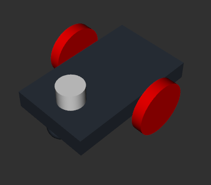
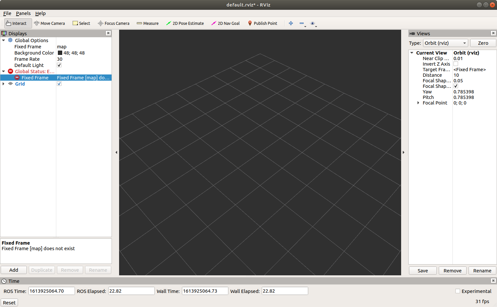
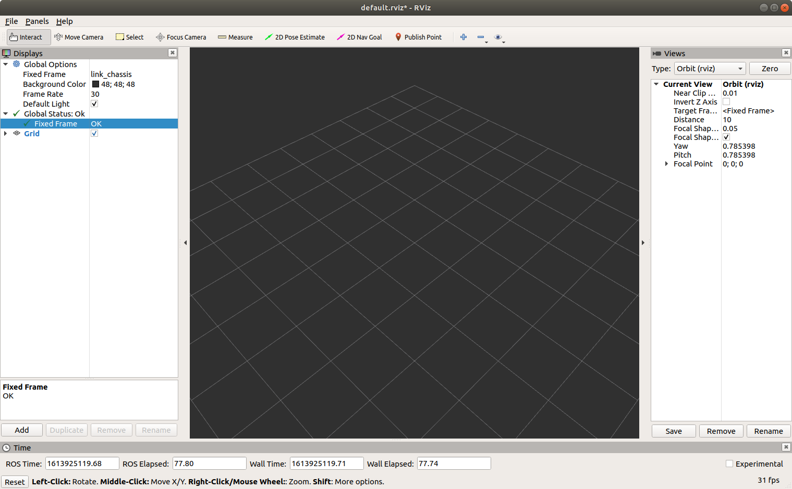
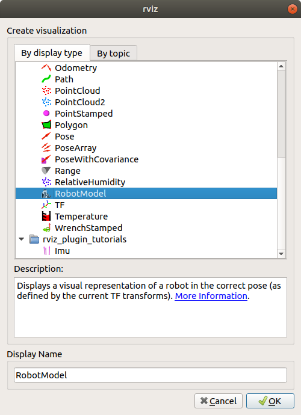
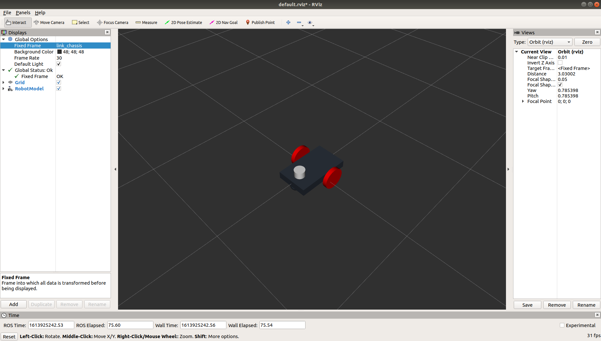

# Lesson 1 - Visualizing the robot with rviz

This lesson illustrates how to visualize the robot model with rviz.</br></br>

## Robot Model

The robot description model files are found in the simulation workspace directory. The URDF (Unified Robot Description Format) and XACRO files are the same as those developed by the The Construct, Exploring ROS Using A 2 Wheeled Robot, lessons 1 - 3.

The robot model consists of link elements, joint elements, and gazebo plugins. A link element is a rigid component. Links are attached to other links via joints. The joint elements specify the relative motion between links. Typically, joints allow for rotation or translation.

The common properties specified for links and joints are inertial, collision, and visual. Inertial and collision properties enable physics simulation. The visual properties control the robot's appearance.

A Gazebo plugin is a C++ library that is loaded by Gazebo at runtime. A plugin has access to Gazebo's API, which allows a plugin to perform a wide variety of tasks including moving objects, adding/removing objects, and accessing sensor data. There are six different [plugin types](http://gazebosim.org/tutorials?tut=plugins_hello_world&cat=write_plugin): (1) World, (2) Model, (3) Sensor, (4) System, (5) Visual, (6) GUI. 

A differential drive model plugin controls robot motion and a sensor plugin provides a laser scanner.</br></br>

### Model Summary

- link elements
   - rectangular chassis
   - two cylindrical drive wheels (left and right)
   - one caster wheel
- joint elements
   - define relative motion of wheels with respect to the chassis
   - specify values for damping and friction
- gazebo plugins
   - model plugin: differential drive
      - accepts velocity commands and publishes odometry information
   - sensor plugin: hoyuko laser scanner 
</br></br>

</br></br>

### Visualize Robot in rviz

rviz is a 3D visualization software tool for robots, sensors, and algorithms. It provides a view of your robot model, captures sensor information from robot sensors, and replays captured data. It can display data from camera, lasers, from 3D and 2D devices including pictures and point clouds. rviz enables you to see the robot’s perception of its world (real or simulated).</br></br>

Open a terminal and type the following.

```
cd simulation_ws
source ./devel/setup.bash
roslaunch robot_description rviz.launch
```

Rviz will launch with a Fixed Frame global status error. </br></br>

</br></br>

Change the Fixed Frame map selection to link_chassis. Click on map, choosing link_chassis from the dropdown.</br></br>

</br></br>

Next, click the Add button and choose RobotModel. </br></br>

</br></br>

Now you see the two-wheel differential drive robot description has been added to the display.</br></br>

</br></br>

We will return to rviz in another lesson. For now, close rviz. You may save your file so that you don't have to reset the fixed frame and add the robot model the next time rviz is launched.</br></br>

## Additional Study

Read and work through the following tutorials to gain an understanding of how the robot model is created.

1. Gazebo, [Make a Mobile Robot tutorial](http://gazebosim.org/tutorials/?tut=build_robot), "demonstrates Gazebo's basic model management, and exercises familiarity with basic model representation inside the model database by taking the user through the process of creating a two wheeled mobile robot that uses a differential drive mechanism for movement." The tutorial adds one component at a time, allowing for experimentation and instantaneous visualization of the effects of changes.

2. [The Construct](https://www.theconstructsim.com/ros-projects-exploring-ros-using-2-wheeled-robot-part-1/) video provides a detailed explanation of the robot model development and source code.

3. [Chapter 2](https://kiranpalla.com/autonomous-navigation-ros-differential-drive-robot-simulation/describing-ros-robot-with-urdf/) of Kiran Palla's free ebook, Autonomous Navigation of ROS Robot: Differential Drive Robot Simulation, provides another example of creating a ROS package for the same differential drive robot form. </br></br>