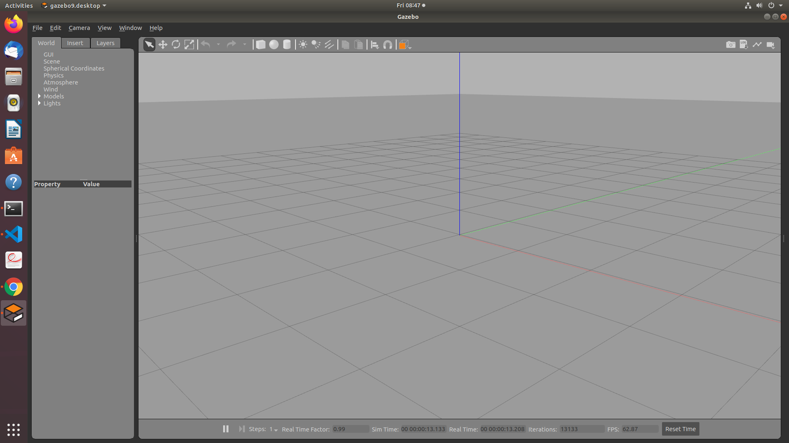

# Lesson 2 - Simulating robot movement in an empty world

We are now ready to simulate the robot in gazebo.

1. Load empty gazebo world.
2. Spawn the robot.
3. Use the keyboard to steer the robot

## Load Robot into Empty World

### Terminal 1, Launch the gazebo world

Open a terminal window and navigate to the simulation workspace folder in the project ros_gazebo_two_wheel_robot. For example, if the project folder is stored in your home directory: `cd ~/ros_gazebo_two_wheel_robot/simulation_ws`

From that directory, run the following commands to overlay the workspace and launch the gazebo simulation.

```bash
source ./devel/setup.bash
roslaunch gazebo_ros empty_world.launch
```

Gazebo will start and display the empty world shown below.

</br></br>

### Terminal 2, Spawn Robot

Open another terminal. From the simulation_ws directory, run the commands shown below. 

```bash
source ./devel/setup.bash
roslaunch m2wr_description spawn.launch
```

## Using teleop_twist_keyboard to Steer the Robot

A node of the ROS packagee teleop_twist_keyboard publishes a topic call cmd_vel that re represents velocity commands for the robot. The Gazebo differential drive plugin subscribes to the cmd_vel topic.