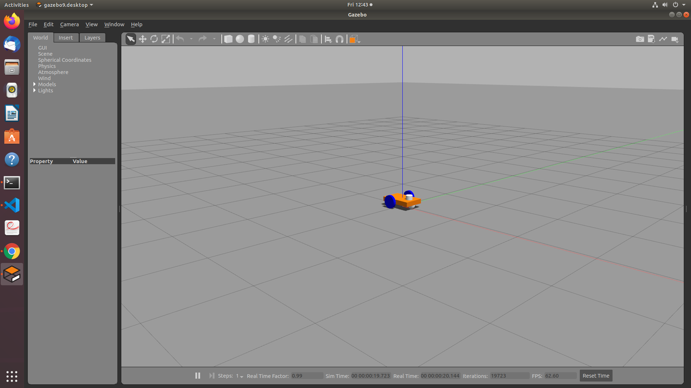
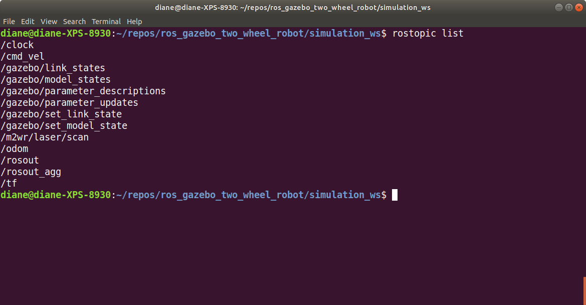
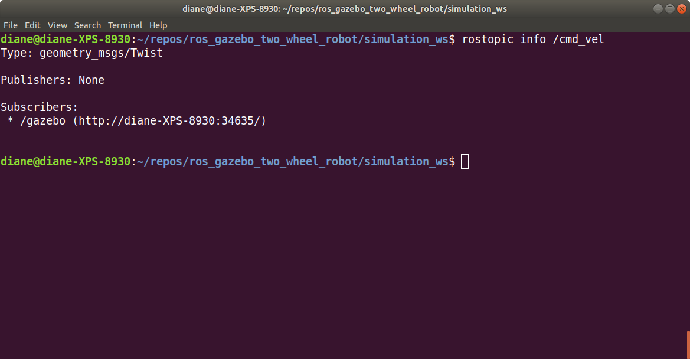
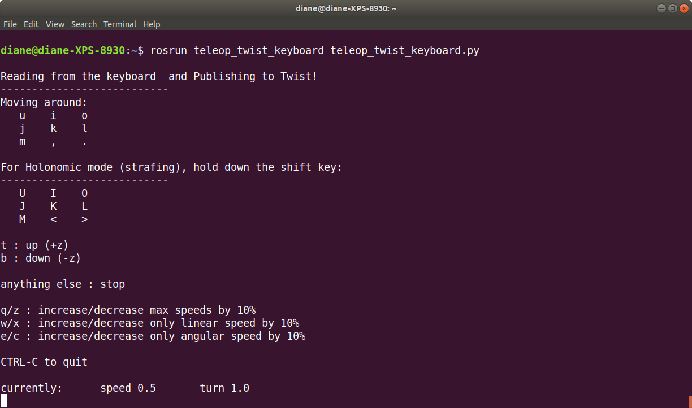
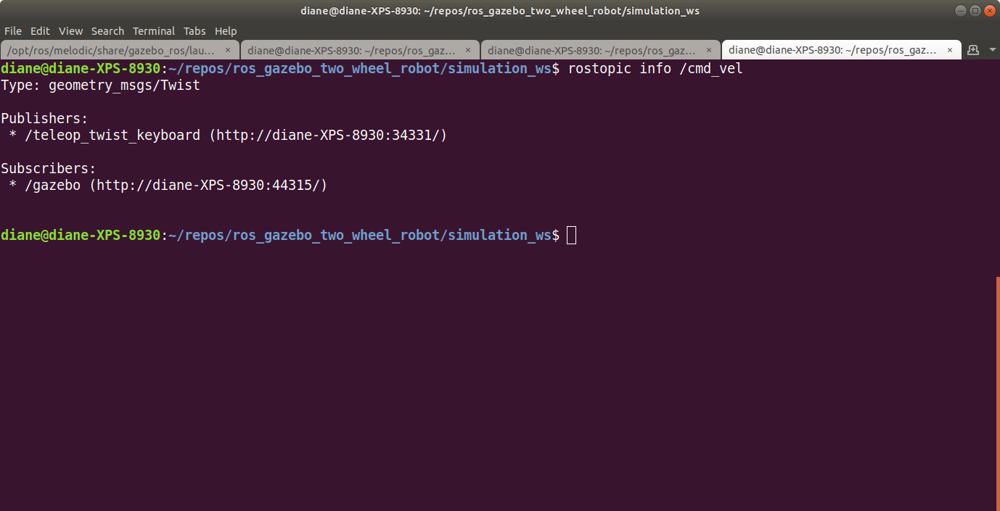

# Lesson 2 - Simulating robot movement in an empty world

We are now ready to simulate the robot in gazebo.

1. Load empty gazebo world.
2. Spawn the robot.
3. Use the keyboard to steer the robot

## Load Robot into Empty World

### Terminal 1, Launch the gazebo world

Open a terminal window and navigate to the simulation workspace folder in the project ros_gazebo_two_wheel_robot. For example, if the project folder is stored in your home directory: `cd ~/ros_gazebo_two_wheel_robot/simulation_ws`

From that directory, run the following commands to overlay the workspace and launch the gazebo simulation.

```bash
source ./devel/setup.bash
roslaunch gazebo_ros empty_world.launch
```

Gazebo will start and display the empty world shown below.

</br></br>

### Terminal 2, Spawn Robot

Open another terminal. From the simulation_ws directory, run the commands shown below to load the robot into the empty world.

```bash
source ./devel/setup.bash
roslaunch m2wr_description spawn.launch
```

The robot will appear in the empty world, as shown below. The spawn.launch file places the robot at the default location: x = 0, y = 0, z = 0.5.

</br></br>

### Terminal 3, ROS Topics

Let's open another terminal and list all the ROS topics.

```bash
rostopic list
```

You will see a list similar to the one below.

</br></br>


We are interested in the /cmd_vel topic. For more information, type `rostopic info /cmd_vel` The message type is geometry_msgs/Twist. gazebo is subscribing to this topic due to the differential drive plugin specified in the file m2wr.gazebo. The command topic tag name used is /cmd_vel.


</br></br>

The /cmd_vel message type is geometry_msgs/Twist. It has fields for linear and angular velocity in relation to the x,y,z axes.

</br></br>

We will use the keyboard to generate robot motion.</br></br>

## Using teleop_twist_keyboard to Steer the Robot

A node of the ROS packagee teleop_twist_keyboard publishes a Twist msg topic named cmd_vel. Run the command shown below.

```bash
rosrun teleop_twist_keyboard teleop_twist_keyboard.py
```

</br></br>

Press i to move the robot forward. Press k to stop the robot. Try the other keys as well to see their effects.

</br></br>

After starting the teleop_twist node, run rostopic list. We now see that the teleop_keyboard_twist node is publishing the cmd_vel topic.

</br></br>
