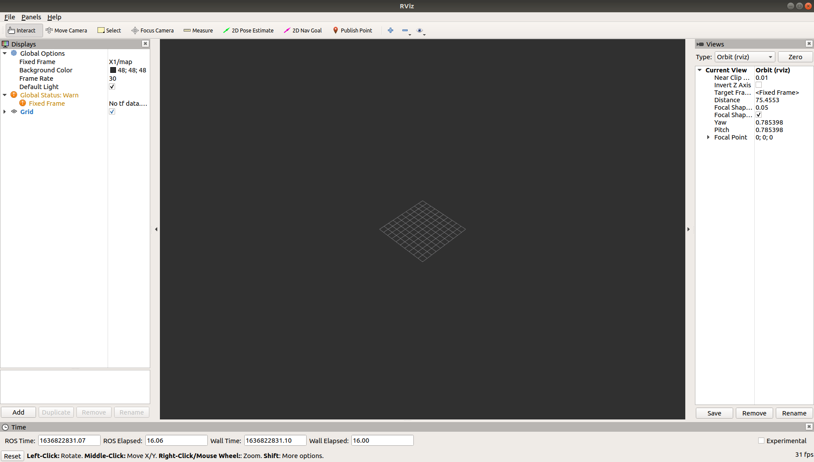
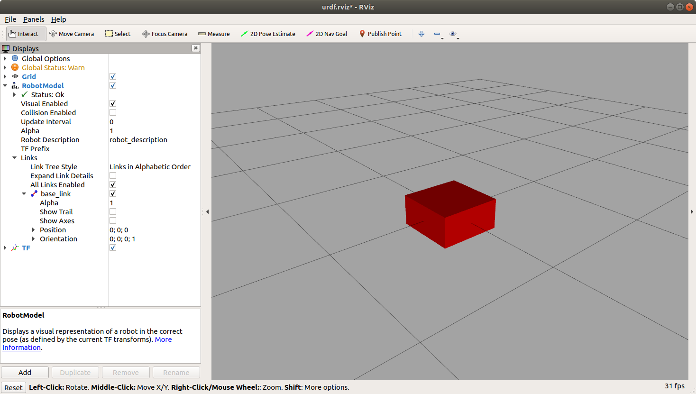

# Lesson 1 - Build and Visualize Robot Chassis

Objectives
- Build the chassis for a differential drive robot model
- Visualize model with rviz
</br></br>

## Building a Differential Drive Robot URDF

URDF is an XML format specifically defined to represent robot models. XML Macros (Xacro) is an XML macro language created to make robot description files easier to read and maintain. Xacro helps reduce the duplication of information within the file.

To model a two-wheeled differential drive robot, we will start with a URDF that models the chassis. The model will be incrementally built in several steps. Robot Visualization (RVIZ) will be used to view the model at each stage.

When the model is complete, Gazebo formatting will added to view the model in the Gazebo simulator.
</br></br>


### Create Robot Chassis - Base Link Visual Model

Two URDF componentes are used to describe a robot model: link components and joint components. The link component describes a rigid body by its physical properties (dimensions, position of its origin, color, and others). Links are connected together by joint components. Joint components describe the kinematic and dynamic properties of the connection (types of joint, axis of rotation, friction, damping). The URDF description is a set of link elements and a set of joint elements connecting the links together.

In the urdf directory, use a text editor to create a file named dd_robot.urdf. Add the code below to describe the robot chassis box. The robot name is dd_robot. It has one link element named base_link. The visual component is a box 0.5 meters long, 0.5 meters wide, and 0.25 meters tall. The box is centered at the origin (0,0,0) of the environment with no rotation in the roll,pitch, or yaw (rpy) axes.

A base_link link is used as the URDF root link to create the beginning of the robot's kinematic chain.

Use a text editor to create a file named dd_robot.urdf in the ~/catkin_ws/src/ddbot/urdf directory. Add the code below to the file and save it.

```xml
<?xml version='1.0'?>
<robot name="dd_robot">

  <!-- Base Link -->
  <link name="base_link">
    <visual>
      <origin xyz="0 0 0" rpy="0 0 0" />
      <geometry>
        <box size="0.5 0.5 0.25"/>
      </geometry>
    </visual>
  </link>

</robot>
```

## Ros Visualization, rviz

rviz is a 3D visualization software tool for robots, sensors, and algorithms. It provides a view of your robot model, captures sensor information from robot sensors, and replays captured data. It can display data from camera, lasers, from 3D and 2D devices including pictures and point clouds. rviz enables you to see the robot’s perception of its world (real or simulated).  

Here, we will use rviz to display the visual representation of the URDF robot model.

### Is rviz installed?

To test if rviz has been installed, open a terminal and start the ROS master by typing

```bash
roscore
```

Open a second terminal and type

```bash
rosrun rviz rviz
```

If rviz is installed, you should see an image similiar to the screenshot below.




If the ```rosrun rviz rviz``` command generates a warning message, make sure that you have ```source ~/catkin_ws/devel/setup.bash``` in your .bashrc file, or this command is entered at the terminal window prompt. The .bashrc file resides in your home directory but cannot be seen unless you use the ```ls –la``` command option to list the directory and files. This option shows the hidden files that are preceded by a dot (.).

If rviz has not been installed, then install it from the Debian repository using the following command:

```bash
sudo apt-get install ros-melodic-rviz
```

</br></br>

## Using roslaunch

Roslaunch is a ROS tool that makes it easy to launch multiple ROS nodes as well as set parameters on the ROS Parameter Server. By using a roslaunch file, there is no need to start the ROS Master with the roscore command. The ROS Master starts automatically if it is not already running. Roslaunch configuration files are written in XML and typically end in a .launch extension.  

General form of roslaunch syntax:

```bash
roslaunch <package_name> <file.launch>
```

We will create a launch file to configure rviz to display our robot model. Create a file named ddbot_rviz.launch in the ddbot/launch directory. The file contents are shown below.  

```xml
<launch>
   <!-- values passed by command line input -->     
   <arg name="model" />
   <arg name="gui" default="False" />

   <!-- set these parameters on Parameter Server -->
   <param name="robot_description" textfile="$(find ddbot)/urdf/$(arg model)" />
   <param name="use_gui" value="$(arg gui)"/>

   <!-- Start 3 nodes: joint_state_publisher, robot_state_publisher and rviz -->
   <node name="joint_state_publisher" pkg="joint_state_publisher" type="joint_state_publisher" />

   <node name="robot_state_publisher" pkg="robot_state_publisher" type="robot_state_publisher" />

   <node name="rviz" pkg="rviz" type="rviz" args="-d $(find ddbot)/rviz/urdf.rviz" required="true" />
   <!-- (required = "true") if rviz dies, entire roslaunch will be killed -->
</launch>
```

The roslaunch file performs the following actions:

- Loads the model specified in the command line into the Parameter Server.
- Starts nodes that publish the JointState and transforms (discussed later).
- Starts rviz with a configuration file (urdf.rviz).
</br></br>

Add the file named urdf.rviz to the src/ddbot/rviz directory.  

We are finally ready to view our robot model in rviz. In the terminal, navigate to the ~/catkin_ws folder and run catkin_make.  

```bash
cd ~/catkin_ws
catkin_make
```

Run the source command below to overlay the workspace.

```bash
source devel/setup.bash
```

Use the launch file to start rviz and see the robot model.

```bash
roslaunch ddbot ddbot_rviz.launch model:=dd_robot.urdf
```

</br></br>
rviz should display the following image.</br></br>

</br></br>

Note:
- The fixed frame is the transform frame where the center (origin) of the grid is located.
- In URDF, the <origin> tag defines the reference frame of the visual element with respect to the reference frame of the link. In dd_robot.urdf, the visual element (the box) has its origin at the center of its geometry by default. Half of the box is above the grid plane and half is below.
- The rviz display configuration has been changed to remove the View and Time displays. 
- The RobotModel and TF displays have been added under the Displays panel. Under RobotModel, notice the following:
Robot description: robot_description is the name of the ROS parameter where the URDF file is stored on the Parameter Server. The description of the links and joints and how they are connected is stored here.

</br></br>

Close rviz.