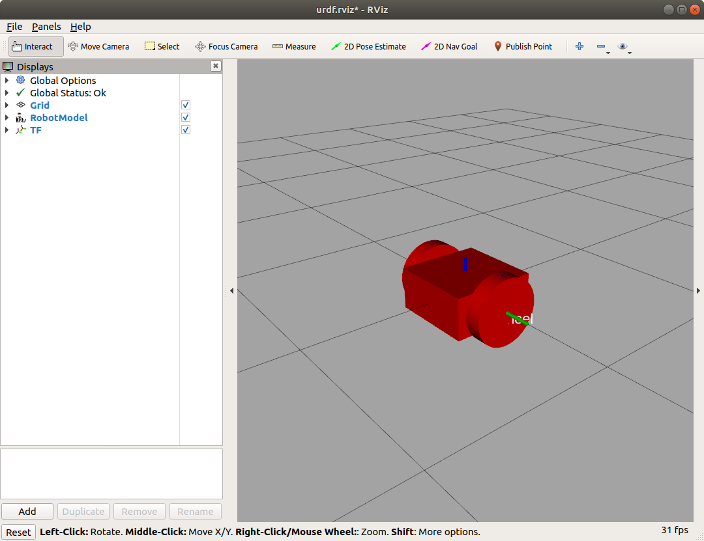
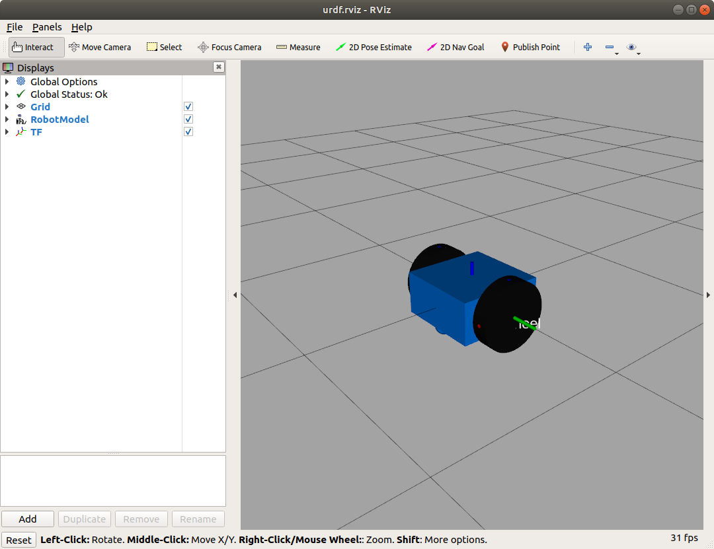

# Lesson 2 - Adding Wheels to the Robot Model

Objectives
- Build a two-wheeled, differential drive robot model
   - Link elements for wheels
   - Joint elements
   - Gazebo plugin for differential drive
- Visualize model with rviz

</br></br>

## Robot Model - Adding Wheels

We add two link elements to the URDF file, for the right and left wheels. The wheel shape is a cylinder with attributes of length and radius.  Link elements are connected together with joint, to describe the relationship between the links. Joint elements define whether the joint is flexible (movable) or inflexible (fixed). For flexible joints, the URDF describes the kinematics and dynamics of the joint as well as its safety limits. In URDF, there are six possible joint types, which are as follows:

- Fixed: This is not really a joint because it cannot move. All degrees of freedom are locked. This type of joint does not require the axis, calibration, dynamics, limits, or safety controller.
- Revolute: This joint rotates around one axis and has a range specified by the upper and lower limits.
- Continuous: This is a continuous hinge joint that rotates around the axis and has no upper and lower limits.
- Prismatic: This is a sliding joint that slides along the axis and has a limited range specified by the upper and lower limits.
- Floating: This joint allows motion for all six degrees of freedom.
- Planar: This joint allows motion in a plane perpendicular to the axis.


The robot wheel joints are continuous, which means they can rotate around their axis to an rotation angle from negative infinity to positive infinity. This allows the wheels to rotate in both directions forever.

The following description is added to the URDF file. The complete, updated description is found in dd_robot2.urdf.

```xml
<?xml version='1.0'?>
<robot name="dd_robot">

  <!-- Base Link -->
  <link name="base_link">
  ...
  </link>

  <!-- Right Wheel -->
  <link name="right_wheel">
    <visual>
      <origin xyz="0 0 0" rpy="1.570795 0 0" />
      <geometry>
        <cylinder length="0.1" radius="0.2" />
      </geometry>
    </visual>
  </link>
  <joint name="joint_right_wheel" type="continuous">
    <parent link="base_link"/>
    <child link="right_wheel"/>
    <origin xyz="0 -0.30 0" rpy="0 0 0" />
    <axis xyz="0 1 0" />
  </joint>

  <!-- Left Wheel -->
  <link name="left_wheel">
    <visual>
      <origin xyz="0 0 0" rpy="1.570795 0 0" />
      <geometry>
        <cylinder length="0.1" radius="0.2" />
      </geometry>
    </visual>
  </link>

  <joint name="joint_left_wheel" type="continuous">
    <parent link="base_link"/>
    <child link="left_wheel"/>
    <origin xyz="0 0.30 0" rpy="0 0 0" />
    <axis xyz="0 1 0" />
  </joint>

</robot>
```

</br></br>


Let's view the updated model with rviz.

```bash
roslaunch ddbot ddrobot_rviz.launch model:=dd_robot2.urdf
```
Now, we see the wheels.




Relating the image we see to the URDF,

- Each wheel is defined visually as a cylinder of radius 0.2 meters and length of 0.1 meters. The wheel's visual origin defines where the center of the visual element should be, relative to its origin. Each wheel's origin is at (0, 0, 0) and is rotated by 1.560795 radians (= pi/2 = 90 degrees) about the x axis.

- The joint is defined in terms of a parent and a child. The URDF file is ultimately a tree structure with one root link. The base_link link is our robot's root link with the wheel's position dependent on position of the base_link.

- The wheel joint is defined in terms of the parent's reference frame. Therefore, the wheel's joint origin is 0.30 meters in the x direction is for the left wheel and -0.30 meters for the right wheel.

- The axis of rotation is specified by a xyz triplet, indicating that the wheel's joint axis of rotation is around the y axis.

- These <joint> elements define the complete kinematic model of our robot.


## Add a caster wheel

A caster wheel is added to the front of the robot to keep the chassis balanced. The caster will only be a visual element added to the chassis and not a joint. The caster will slide along the ground plane as the robot's wheels move.

The dd_robot3.urdf file contains the XML code for the robot, with the added caster wheel. The code below has been added. 

```xml
<?xml version='1.0'?>
<robot name="dd_robot">

  <!-- Base Link -->
  ...
    <!-- Caster -->
    <visual name="caster">
      <origin xyz="0.2 0 -0.125" rpy="0 0 0" />
      <geometry>
        <sphere radius="0.05" />
      </geometry>
    </visual>

  </link>
  <!-- Right Wheel -->
  ...
  <!-- Left Wheel -->
  ...
</robot>
```

</br></br>
The caster is defined visually as a sphere with a radius of 0.05 meters. The center of the caster is 0.2 meters in the x direction and -0.125 meters in the z direction with respect to the origin of the base_link.

Now, launch rviz with the updated model.

```bash
roslaunch ddbot ddrobot_rviz.launch model:=dd_robot3.urdf
```

</br></br>
The caster wheel should now be visible, as shown below.


</br></br>

## Adding Color

The file dd_robot4.urdf contains material tags that define the color of each link element.

The <material> tag can define <color> in terms of red/green/blue/alpha, each in the range of [0, 1]. Alpha is the transparency level of the color. An alpha value of 1 is opaque and 0 is transparent. Once specified and labeled with a name, the material name can be reused without specifying the color values. (For example, note that the left wheel does not have a <color rgba> tag because it has been defined in the right wheel visual link.)

The following code was added to the file.

```xml
<?xml version='1.0'?>
<robot name="dd_robot">

  <!-- Base Link -->
  ...
      <material name="blue">
        <color rgba="0 0.5 1 1"/>
      </material>
    </visual>

    <!-- Caster -->
    ...
  <!-- Right Wheel -->
  ...
      <material name="black">
        <color rgba="0.05 0.05 0.05 1"/>
      </material>
    </visual>
 ...
  <!-- Left Wheel -->
  ...
      <material name="black"/>
    </visual>
  ...
</robot>
```

Launch rviz to see the changes.

```bash
roslaunch ddbot ddrobot_rviz.launch model:=dd_robot4.urdf
```

Now the wheels are distinctive from the chassis.



