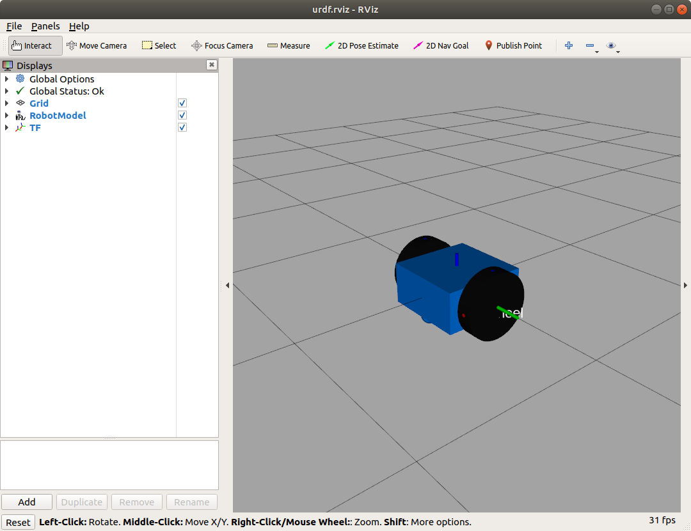
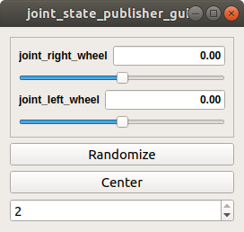

# Lesson 3 - Adding Collision Properties

Gazebo's collision detection engine uses the collision property to identify the boundaries of the object. If an object has complex visual properties (such as a mesh), a simplified collision property should be defined in order to improve the collision detection performance.

The dd_robot5.urdf file contains the XML code with the added collision properties shown below.  

```xml
<?xml version='1.0'?>
<robot name="dd_robot">

  <!-- Base Link -->
  ...
    <!-- Base collision -->
    <collision>
      <origin xyz="0 0 0" rpy="0 0 0" />
      <geometry>
        <box size="0.5 0.5 0.25"/>
      </geometry>
    </collision>

    <!-- Caster -->
    ...
    <!-- Caster collision -->
    <collision>
      <origin xyz="0.2 0 -0.125" rpy="0 0 0" />
      <geometry>
        <sphere radius="0.05" />
      </geometry>
    </collision>
  </link>

  <!-- Right Wheel -->
  ...
    <!-- Right Wheel collision -->
    <collision>
      <origin xyz="0 0 0" rpy="1.570795 0 0" />
      <geometry>
        <cylinder length="0.1" radius="0.2" />
      </geometry>
    </collision>
  ...

  <!-- Left Wheel -->
  ...
    <!-- Left Wheel collision -->
    <collision>
      <origin xyz="0 0 0" rpy="1.570795 0 0" />
      <geometry>
        <cylinder length="0.1" radius="0.2" />
      </geometry>
    </collision>
</robot>
```
</br></br>

## Moving the Wheels with rviz GUI

The ddrobot_rviz.launch file starts three ROS nodes: joint_state_publisher, robot_state_publisher, and rviz. The joint_state_publisher node finds all of the non-fixed joints and publishes a JointState message with all those joints defined. So far, the values in the JointState message have been constant, keeping the wheels from rotating. We bring up a GUI interface in rviz to change the value of each JointState and watch the wheels rotate.

Install the following package.

```bash
sudo apt install ros-melodic-joint-state-publisher-gui
```

Add the gui field to the rviz roslaunch command:

```bash
roslaunch ddbot ddrobot_rviz.launch model:=dd_robot5.urdf gui:=True
```

You should see the rviz window and the gui panel, as shown in the screenshots below.



</br></br>



</br></br>

>Notes  
>> The joint positions in the window are sliders. The wheel joints are defined as continuous but this GUI limits each slider's value from –Pi to +Pi. Play with the sliders and see how the wheels move.  

>>The Randomize button will select a random value for both the joints.

>>The Center button will move both the joints to the zero position. (Visually, the blue dot on both the wheels should be at the top.)

>>The bottom selection allows the user to select the configuration of the slider display, either listed one below the other, or side-by-side.


</br></br>

### Transforms tf and robot state publisher

A robotic system is made up of a collection of 3D coordinate frames for every component in the system. In our dd_robot model, there is a base coordinate frame and a frame for each wheel that relates back to the base coordinate frame. The model's coordinate frames are also related to the world coordinate frame of the 3D environment. The tf package is the central ROS package used to relate the coordinate frames of our robot to the 3D simulated environment (or a real robot to its real environment).

The robot_state_publisher node subscribes to the JointState message and publishes the state of the robot to the tf transform library. The tf transform library maintains the relationships between the coordinate frames of each component in the system over time. The robot_state_publisher node receives the robot's joint angles as inputs and computes and publishes the 3D poses of the robot links. Internally, the robot_state_publisher node uses a kinematic tree model of the robot built from its URDF. Once the robot's state gets published, it is available to all components in the system that also use tf.