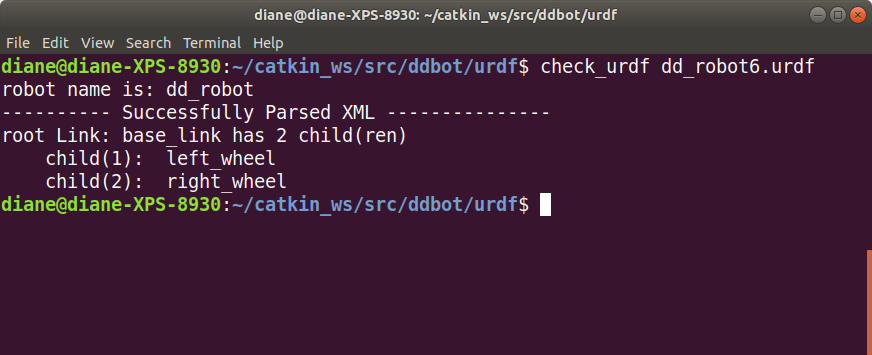
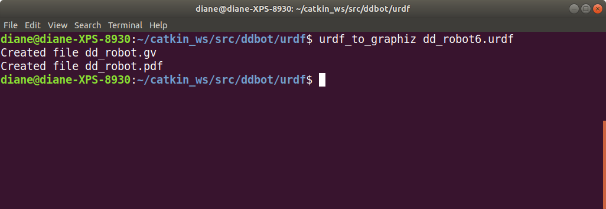
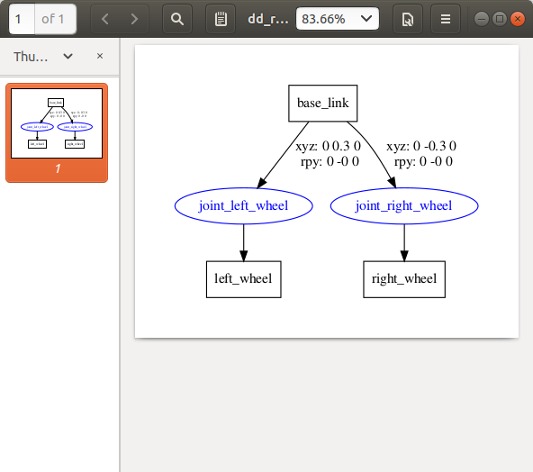

# URDF Tools

ROS provides command-line tools that can help verify and visualize information about your URDF. Install the tools with the following command:

```bash
sudo apt-get install liburdfdom-tools
```

## check_urdf

check_urdf attempts to parse a URDF file description and either prints a description of the resulting kinematic chain or an error message. (Be sure to run this command from the directory containing the dd_robot6.urdf file.)

```bash
check_urdf dd_robot6.urdf
```

Example output:



</br></br>

### urdf_to_graphviz

The urdf_to_graphiz tool creates a graphviz diagram of a URDF file and a diagram in the .pdf format. Graphviz is open-source graph visualization software.

To execute urdf_to_graphiz, type:

```bash
urdf_to_graphiz dd_robot6.urdf
```
</br></br>



</br></br>

Open the .pdf file with the following command:

```bash
evince dd_robot.pdf
```
</br></br>




</br></br>

Now that we have a working URDF model of our two-wheeled robot, we are ready to launch it into Gazebo and move it around. First, we must make some modifications to our URDF file to add simulation-specific tags so that it properly works in Gazebo. Gazebo uses SDF, which is similar to URDF, but by adding specific Gazebo information, we can convert our dd_robot model file into an SDF-type format.