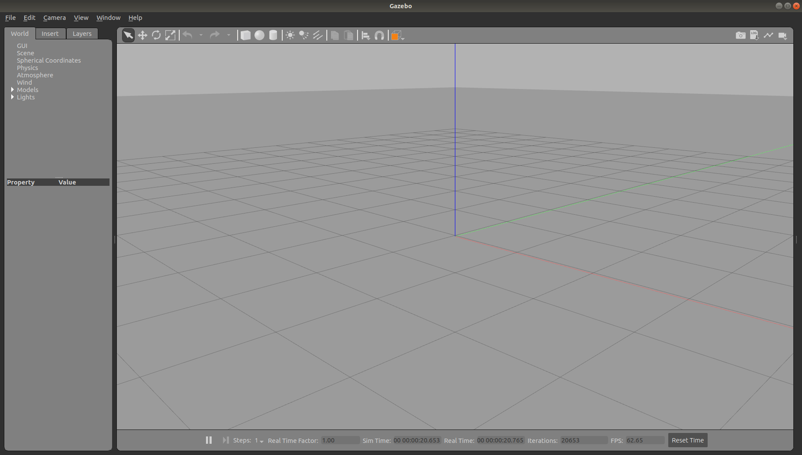

# Gazebo

Gazebo is a 3D dynamic simulator with the ability to accurately and efficiently simulate populations of robots in complex indoor and outdoor environments. While similar to game engines, Gazebo offers physics simulation at a much higher degree of fidelity, a suite of sensors, and interfaces for both users and programs.

Typical uses of Gazebo include:

- testing robotics algorithms
- designing robots
- performing regression testing with realistic scenarios
  - regression testing is defined as a type of software testing to confirm that a recent program or code change has not adversely affected existing features.

A few key features of Gazebo include:

- multiple physics engines
- a rich library of robot models and environments
- a wide variety of sensors
- convenient programmatic and graphical interfaces


## Installing and launching Gazebo

Gazebo should already be installed as part of the ros-melodic-desktop-full installation. To see if it has been installed, open a terminal window and type the following command:

```bash
gazebo
```

If installed, an environment similar to the screenshot below will appear. If not, gazebo installation instructions are found at http://gazebosim.org/tutorials?cat=install. Make sure you install the version of gazebo that matches the ROS distro. For example, ros-melodic uses Gazebo version 9.


</br></br>

The gazebo command runs two different executables: the Gazebo server and the Gazebo client. The Gazebo server gzserver will execute the simulation process, including the physics update loop and sensor data generation. This process is the core of Gazebo and can be used independently of any graphical interface. The Gazebo client gzclient command runs the Gazebo GUI. This GUI provides a nice visualization of simulation and handy controls for an assortment of simulation properties.

Tutorials for Gazebo can be found at http://gazebosim.org/tutorials.

### Shutting Down Gazebo

Use the Ctrl + C keys to kill the terminal window process after closing the gazebo window.

If you are running gazebo with ros nodes, and shutting down gazebo generates a warning or error, type ```rosnode list``` to see whether there are active nodes after attempting to shut down gazebo. If nodes are still active, use the ```rosnode kill``` command to list them. The command ```rosnode kill -a``` will kill all active nodes. Or ```rosnode kill [node]``` with the node name to kill specific nodes.

</br></br>

## Using roslaunch with Gazebo

Roslaunch is a standard method used to start Gazebo with world files and robot URDF models. To perform a basic test of Gazebo, an empty Gazebo world can be brought up with the following command:

```bash
roslaunch gazebo_ros empty_world.launch
```

This test will verify that Gazebo has been installed properly. If you wish to try other demo worlds, including the gazebo_ros package, try substituting one of the following with empty_world.launch in the previous command:

- willowgarage_world.launch
- mud_world.launch
- shapes_world.launch 
- rubble_world.launch



</br></br>


## Mouse Control with Gazebo

The central window provides the view for Gazebo's 3D world environment. The grid is typically configured to be the ground plane of the environment on which all the models are held due to gravity in the environment. A red-green-blue axis is provided at the origin of the 3D Cartesian co-ordinate system. The red axis represents the x axis, green is y and blue is z.

Gazebo mouse controls to navigate the scene:


</br></br>

Double-clicking on a spot in the environment will cause the display to be zoomed in to that spot.

Gazebo keyboard shortcuts: http://gazebosim.org/hotkeys