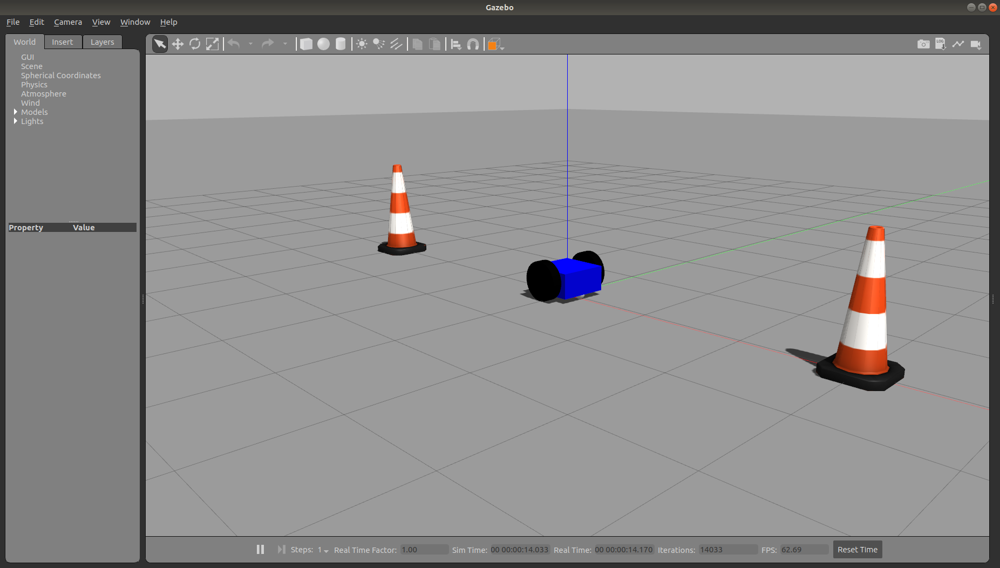

# Lesson 7 - Modify Robot URDF for Gazebo

Gazebo expects the robot model file to be in SDF format. SDF is similar to the URDF, using some of the same XML descriptive tags. With the following modifications, Gazebo will automatically convert the URDF code into an SDF robot description. The following sections will describe the steps to be taken.

Adding the Gazebo tag
The ```<gazebo>``` tag must be added to the URDF to specify additional elements needed for simulation in Gazebo. This tag allows for identifying elements found in the SDF format that are not found in the URDF format. If a ```<gazebo>``` tag is used without a reference="" property, it is assumed that the ```<gazebo>``` elements refer to the whole robot model. The reference parameter usually refers to a specific robot link.

More information about ```<gazebo>``` elements for both the links and joints is found here: http://gazebosim.org/tutorials/?tut=ros_urdf


## Specifying Color in Gazebo

The method of specifying link colors in rviz does not work in Gazebo since Gazebo has adopted OGRE's material scripts for coloring and texturing links. Therefore, a Gazebo ```<material>``` tag must be specified for each link. These tags can be placed in the model file just before the ending ```</robot>``` tag:

```xml
<gazebo reference="base_link">
  <material>Gazebo/Blue</material>
</gazebo>

<gazebo reference="right_wheel">
  <material>Gazebo/Black</material>
</gazebo>

<gazebo reference="left_wheel">
  <material>Gazebo/Black</material>
</gazebo>
```

</br></br>

## Verifying a Gazebo model

The dd_robot URDF has been updated with the ```<gazebo>``` tags and the ```<material>``` elements, as described earlier, and is stored in the downloaded file, dd_robot.gazebo. The file extension .gazebo is not required, but adopted by the author as a convention to indicate it the gazebo version.


To check whether your URDF can be properly converted into an SDF. Simply run the following command:

```bash
gz sdf -p $(rospack find ddbot)/urdf/dd_robot.gazebo
```

This command outputs the entire SDF to the screen so you may wish to redirect the output to a file. The output will show you the SDF that has been generated from your input URDF as well as any warnings about the missing information required to generate the SDF.


## Viewing ddbot in Gazebo

The ddrobot_gazebo.launch file inherits most of the necessary functionality from empty_world.launch from the gazebo_ros package. The only parameter that is changed is the world_name parameter by substituting the ddrobot.world world file. The URDF-based dd_robot model is launched into Gazebo using the ROS spawn_model service from the gazebo_ros ROS node.

Run the following command in the terminal.

```bash
roslaunch ddbot ddrobot_gazebo.launch
```

</br></br>



</br></br>

## Summary

This was a brief introduction to URDF models. To build a more complete model with additional sensor capabilities, we need to extend the URDF model. The next unit will introduce a completed mode for the TurtleBot, so that we can begin to implement autonomous mobile robot navigation.